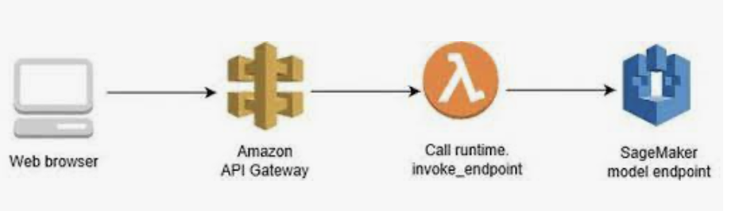
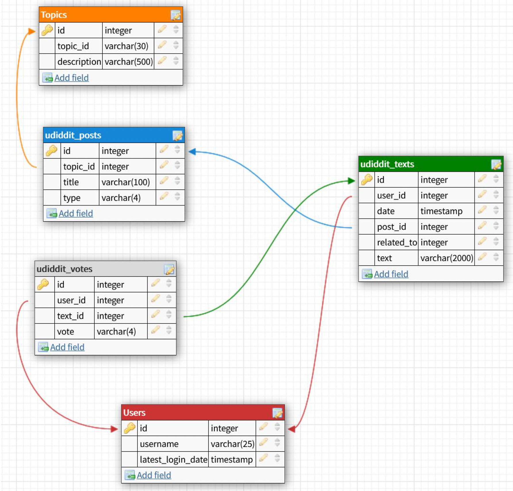

### Hi there 👋,

thank you much for visiting my GitHub profile. 

I hope this page will provide you with a sound overview on my portfolio projects realized from 2020 up to now:

### Data Science & AI Portfolio Projects ###

#### Image Classification ###

---

**🌱 Flower Classifier**: Do you know the app "Picture This"? You can classify trees and plants using this app. In this project a neural network for such kind of image classification shall be created with Python and PyTorch as a framework. It can't classify anything else than flowers. It is therefore a "Flower Classifier". The project has been realized in my Udacity Nanodegree certification course "AI Programming with Python" and was the second of two projects I realized. 

- Input data are *images*
- Output data is *flower name*
- Algorithm used is *MLP* in PyTorch
- enhanced by transfer learning

[Click here to show repository](https://github.com/Quirly/udacity-AI-app-flower-classification)

---

**🌱 Dog Breed Classifier**: This is a neural network for image classification created with Python and PyTorch as a framework. The project has been realized in my Udacity Nanodegree certification course "Deep Learning" and was the second of two projects I implemented. Here, a Convolutional Neural Network (CNN) was used.

- Input data are *images*
- Output data is *dog breed name*
- Algorithm used is *CNN* in PyTorch

[Show Repository](https://github.com/Quirly/Udacity_DL_02_DogBreedClassifier)

---

#### Predicting Time Series Data ###

---

**🌱 Predicting Bike Sharing Patterns**: This is a neural network where historical tabular data is used to predict bike sharing patterns in New York City based on various features like e.g. temperature, wind speed, historical bike usage pattern etc. This neural network has been created with Python and *NumPy* only, without a framework like *PyTorch*. The project has been realized in my Udacity Nanodegree certification course "Deep Learning" and was the first of five projects I submitted. The goal of this project was to learn how to deal with matrix multiplication in Neural Networks. The sizes have to match with each other in the calculation sequence so that forward pass and backpropagation work. 

- Input data is *tabular time series data*
- Output data is *tabular time series data*
- No ready-to-use algorithm, hands on implementation in Numpy

[Show Repository](https://github.com/Quirly/udacity_predicting_bike_sharing_patterns)

---

#### Seq2Seq Networks for Text Generation ####

**🌱 Generate TV Scripts**: This is a RNN/LSTM network architecture where text data is used to generate a script dialogue for the US sitcom "Seinfeld". This neural network has been created with Python and *PyTorch*. The project has been implemented/developed within in my Udacity Nanodegree certification course "Deep Learning" and was the third of five projects I realized. The goal of this project was to learn how networks can be trained with specific texts to generate new texts being given some words as a starting point. 

- Input data is *text data* (existing TV scripts of US sitcom "Seinfeld")
- Output data is *script text*
- Algorithm used is a combination of ***RNN*** and ***LSTM*** in ***PyTorch***

[Show Repository](https://github.com/Quirly/udacity-AI-DL-RNN_NLP_TV_script_generation)

---

#### Great Adversarial Networks (GANs) ####

**🌱 Generate Imaginary Celebrity Faces with CycleGANs**: This is a GAN network architecture where existing, published pictures from celebrities are used to train a GAN model in order to later create new, realistic imaginary pictures of not existing celebrities. This neural network has been created with Python and *PyTorch*. The project has been realized in my Udacity Nanodegree certification course "Deep Learning" and was the fourth of five projects I implemented. The goal of this project was to learn how GAN networks can be used to generate completely new images given a set of images of the same type. 

- Input data is *image data* (Celebrities)
- Output data is *image data*
- Algorithm used is ***GAN*** in ***PyTorch***

[Show Repository]()

---

#### Model Deployment in the AWS Cloud ####

**🌱 Sentiment Analysis**: This is a sentiment analysis network which was set up and then deployed within the AWS cloud. A text review is entered and sent to the trained model hosted in AWS. Then, the model interprets the feeling of the author of the review based on the words chosen in the written text. The endpoint will then return an estimation as output to the requesting user. This neural network has been created with Python and *PyTorch* and was deployed using AWS Sagemaker. The project has been realized in my Udacity Nanodegree certification course "Deep Learning" and was the fifth of five projects I worked on. The goal of this project was to learn how to deploy models in the AWS Cloud. 

- Input data is *text data* (reviews)
- Output data is a ranking (feeling/mood of the author)
- Model was deployed in AWS Cloud

[Show Repository](https://github.com/Quirly/Udacity_DeepLearning_AWS_SentimentAnalysis)

---

### Data Engineering (with AWS) Portfolio Projects ###

**🌱 Relational Data Models/Cloud Implementation**:
The challenge was that a startup called "Sparkify" wanted to analyze the data they've been collecting on songs and user activity on their new music streaming app. The analytics team is particularly interested in understanding what songs users are listening to. The company did not have an easy way to query their data, which resides in a directory of JSON logs on user activity on the app, as well as a directory with JSON metadata on the songs in their app.

The project scope was to create a Postgres database with tables designed to optimize queries on song play analysis. My task was to create a database schema and ETL pipeline for this analysis. Tests of my database and ETL pipeline by running queries provided by the analytics team from "Sparkify" shall be run evaluated by comparison of my results with expected results.

- Input data is *log files* (JSON)
- Output data is a relational data model (star schema)
- Infrastructure used is on AWS Cloud 

[Show Repository]()

---

**🌱 NoSQL Data Models/Cloud Implementation**:
The challenge was that a startup called "Sparkify" wanted to analyze the data they've been collecting on songs and user activity on their new music streaming app. The analytics team is particularly interested in understanding what songs users are listening to. The company did not have an easy way to query their data, which resides in a directory of JSON logs on user activity on the app, as well as a directory with JSON metadata on the songs in their app.

The project scope was to create a **Apache Cassandra** implementaton with tables designed to optimize queries on song play analysis. My task was to create a database schema and ETL pipeline for this analysis. Tests of my database and ETL pipeline by running queries provided by the analytics team from "Sparkify" shall be run evaluated by comparison of my results with expected results.

- Input data is *log files* (JSON)
- Output data is a NoSQL data model (Apache Cassandra)
- Infrastructure used is on AWS Cloud 

[Show Repository]()

**🌱 Amazon Redshift Data Warehouse/Cloud Implementation**:
The challenge was that a startup called "Sparkify" wanted to analyze the data they've been collecting on songs and user activity on their new music streaming app. The analytics team is particularly interested in understanding what songs users are listening to. The company did not have an easy way to query their data, which resides in a directory of JSON logs on user activity on the app, as well as a directory with JSON metadata on the songs in their app.

To provide a solution, the project scope was to create a **Amazon Redshift Data Warehhouse Cluster** implementaton with a data model implemented via facts & dimension tables, using a star schema. My task was to create this data model and ETL pipelines for a) staging and b) loading into the final tables of the Cloud DWH. Cloud infrastructure was created using Python boto3 as a library. You will get the best impression working with the Jupyter Notebook and your own AWS account. 

- Input data is *log files* (JSON)
- Output data is a Cloud Data Warehouse with a star schema data model (Amazon Redshift Cluster)
- Infrastructure used is on AWS Cloud 

[Show Repository]()

---

### SQL (PostgreSQL) Portfolio Projects ###

---

**🌱 Advanced SQL Querying**: This project was realized withing my "Udacity SQL Nanodegree", advanced querying techniques shall be practiced. What was this project about? A company is looking to understand which countries and regions around the world seem to have forests that have been shrinking in size, and also which countries and regions have the most significant forest area, both in terms of amount and percent of total area. The hope is that these findings can help to achieve the largest impact with the precious few resources that the organization has at its disposal. Tables of data have been found online dealing with forestation as well as total land area and region groupings, and these tables were brought together into a database that shall be now be queried to answer some of the most important questions in preparation for a meeting coming up in a few days. Ahead of the meeting a report had to be created providing a deforestation overview between 1990 and 2016.

🔭 [Show Repository](https://github.com/Quirly/Udacity_SQL_01_Deforestation)

---

**🌱 Database Design & Database Migration**: This project is the second submission within my "Udacity SQL Nanodegree". What is this about? Udiddit is a social news aggregator, content rating, and discussions website. On Udiddit, registered users are able to link to external content or post their own text content about various topics. In turn, other users can comment on these posts, and each user is allowed to cast a vote about each post, either in an up (like) or down (dislike) direction. Unfortunately, due to some time constraints before the initial launch of the site, the data model stored in Postgres hasn’t been well thought out, and is outdated - now there has a new setup to be designed: first, make an assessment of the situation and take steps to fix all the issues with the current data model, and then, once successful, to improve the current system by making it more robust and adding some web analytics.

🔭  [Show Repository](https://github.com/Quirly/Udacity_SQL_02_Uddidit_DatabaseSetup)

---

### Front End Web Development ###

---

**🌱 Landing Page**: This project is the second submission within my "Udacity Front End Web Developer Nanodegree". What is this about? I needed to build a landing page which adapts automatically depending on the content published. If you delete one article, automatically the navigation bar is adapted, if you add one, it is extended.

🔭  [Show Repository](https://github.com/Quirly/Udacity_Web_FE_02_Landing_Page)

:framed_picture: [Show Website in Action](http://mylandingpagequirlyudacity.s3-website-us-west-2.amazonaws.com)

---

<!--
**Quirly/Quirly** is a ✨ _special_ ✨ repository because its `README.md` (this file) appears on your GitHub profile.

Here are some ideas to get you started:

- 🔭 I’m currently working on ...
- 🌱 I’m currently learning ...
- 👯 I’m looking to collaborate on ...
- 🤔 I’m looking for help with ...
- 💬 Ask me about ...
- 📫 How to reach me: ...
- 😄 Pronouns: ...
- ⚡ Fun fact: ...
-->

